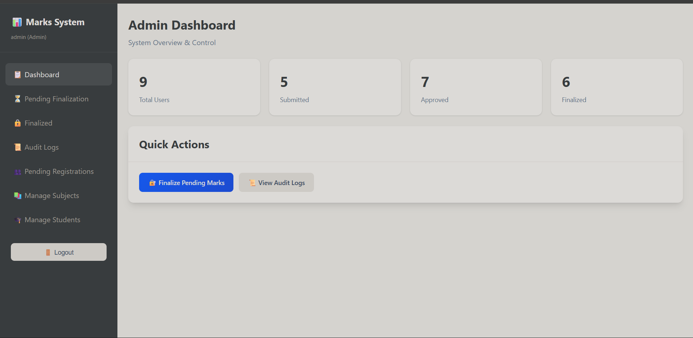

# Secure Internal Marks Moderation & Approval System

A comprehensive system for faculty to upload internal marks, HODs to moderate and approve them, and admins to finalize with robust security measures.

## 🔐 Security Features



- **AES-256 Encryption** for marks data at rest
- **SHA-256 Hashing** for integrity verification
- **RSA Digital Signatures** for HOD and Admin approvals
- **NIST SP 800-63B** compliant password policy
- **JWT Authentication** with refresh tokens
- **OTP Two-Factor Authentication** via email
- **Role-Based Access Control** (Faculty, HOD, Admin)
- **Rate Limiting** for brute-force protection
- **Comprehensive Audit Logging**

## 📁 Project Structure

```
focys/
├── frontend/          # React CRA
│   ├── src/
│   │   ├── components/
│   │   ├── context/
│   │   ├── pages/
│   │   └── services/
│   └── package.json
│
├── backend/           # Flask API
│   ├── app/
│   │   ├── routes/
│   │   ├── services/
│   │   ├── middleware/
│   │   └── utils/
│   ├── requirements.txt
│   ├── run.py
│   └── seed.py
│
└── README.md
```

## 🚀 Quick Start

### Prerequisites

- Python 3.8+
- Node.js 16+
- MongoDB (running on localhost:27017)

### Backend Setup

```bash
cd backend

# Create virtual environment
python -m venv venv
venv\Scripts\activate  # Windows
# source venv/bin/activate  # Linux/Mac

# Install dependencies
pip install -r requirements.txt

# Copy environment file
copy .env.example .env
# Edit .env with your configuration

# Seed database with demo data
python seed.py

# Run Flask server
python run.py
```

### Frontend Setup

```bash
cd frontend

# Install dependencies
npm install

# Start development server
npm start
```

## 👥 Demo Credentials

| Role    | Username | Password    |
|---------|----------|-------------|
| Faculty | faculty1 | password123 |
| Faculty | faculty2 | password123 |
| HOD     | hod_cs   | password123 |
| Admin   | admin    | admin123    |

**Note:** OTP will be displayed in the console if email is not configured.

## 🔄 Workflow

1. **Faculty** logs in → uploads internal marks → marks are encrypted & hashed
2. **HOD** reviews marks → can moderate → approves with digital signature
3. **Admin** verifies signature & hash → finalizes with admin signature → marks are locked

## 📡 API Endpoints

### Authentication
- `POST /api/auth/login` - Step 1: Validate credentials, send OTP
- `POST /api/auth/verify-otp` - Step 2: Verify OTP, get JWT
- `POST /api/auth/logout` - Logout
- `POST /api/auth/register` - Register (demo only)

### Faculty
- `GET /api/faculty/subjects` - Get assigned subjects
- `GET /api/faculty/students/:subjectId` - Get students
- `POST /api/faculty/marks` - Submit marks
- `GET /api/faculty/marks` - View submitted marks

### HOD
- `GET /api/hod/department-marks` - Get department marks
- `PUT /api/hod/moderate/:markId` - Moderate marks
- `POST /api/hod/approve/:markId` - Approve with signature

### Admin
- `GET /api/admin/pending` - Get pending marks
- `POST /api/admin/verify/:markId` - Verify signature/hash
- `POST /api/admin/finalize/:markId` - Final lock
- `GET /api/admin/dashboard` - System stats

### Audit
- `GET /api/audit/logs` - Get audit logs
- `GET /api/audit/export` - Export logs as CSV

## 🛡️ Security Implementation

### Password Policy (NIST SP 800-63B)
- Minimum 8 characters
- Check against common passwords
- No forced complexity requirements

### Encryption
- AES-256-CBC for marks data
- Random IV for each encryption
- Key stored in environment variables

### Digital Signatures
- RSA-2048 key pairs per user
- Signatures verify approver identity
- Timestamp included in signed data

## 📝 License

MIT License
